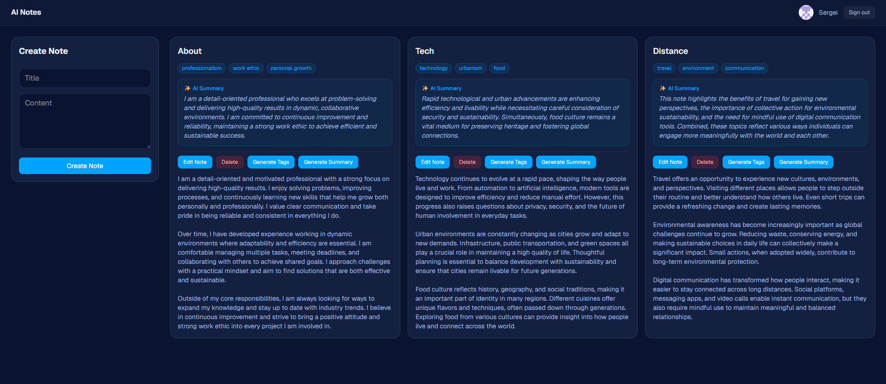

# AI Notes

Smart note-taking with AI-powered summaries and tags.
Built with Next.js 15, TypeScript, Prisma, and the Gemini API.

**Live demo:** https://ai-notes-omega-lime.vercel.app/

## Features

- GitHub and Google OAuth (NextAuth v5)
- Per-user notes with full CRUD
- **AI summary** generation with streaming responses (Gemini)
- **AI tag** generation
- React 19 server actions with `useActionState` for inline form errors
- Confirm dialog on delete
- Mobile-responsive design with Tailwind v4
- Custom error fallback page (`error.tsx`)

## Stack

- **Framework:** Next.js 15 (App Router, server components)
- **Language:** TypeScript
- **Database:** PostgreSQL (Neon) + Prisma 7
- **Auth:** NextAuth v5
- **AI:** Google Gemini (`@google/genai`)
- **Styling:** Tailwind CSS v4
- **Deploy:** Vercel

## Local setup

\`\`\`bash
git clone https://github.com/Sergei1790/ai-notes.git
cd ai-notes
npm install
cp .env.example .env  # fill in real values
npx prisma migrate dev
npm run dev
\`\`\`

## Notes

This is a learning project. The streaming summary and `useActionState` form handling were the most interesting parts to build.
